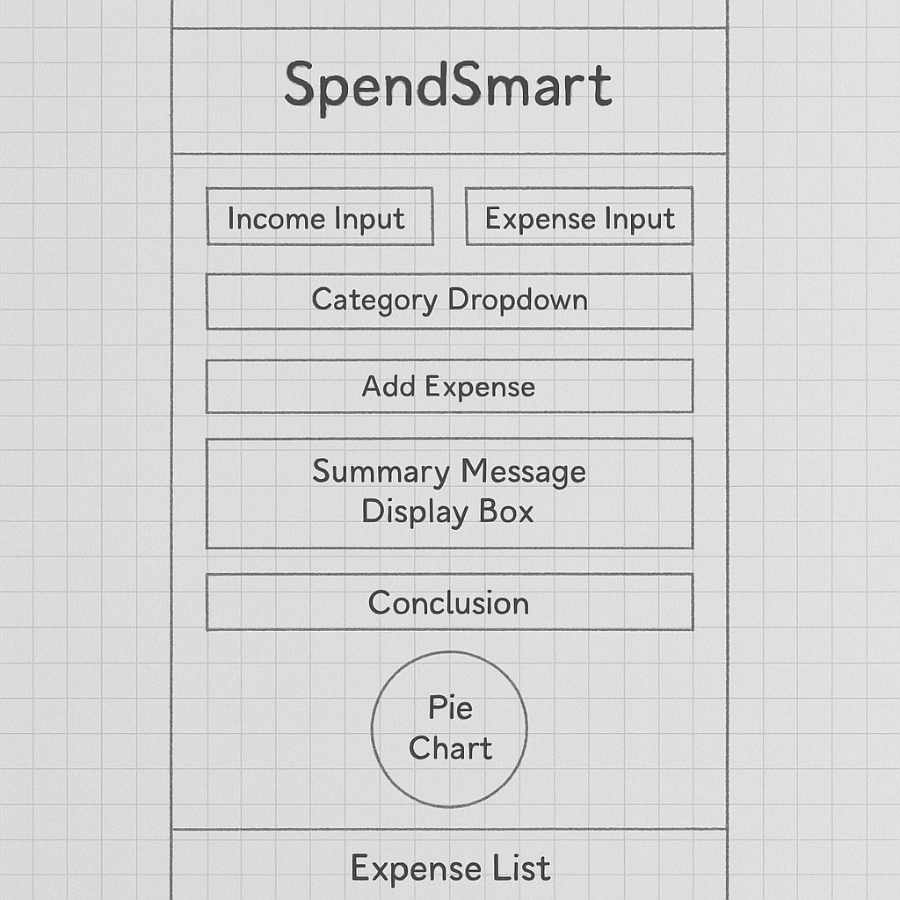
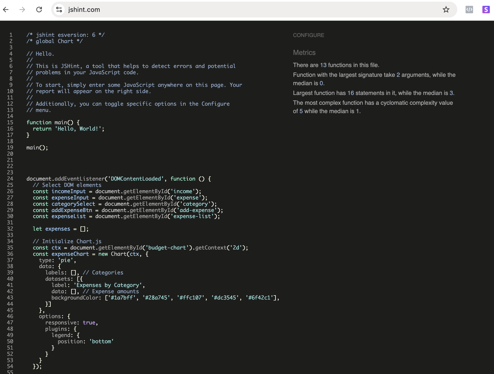
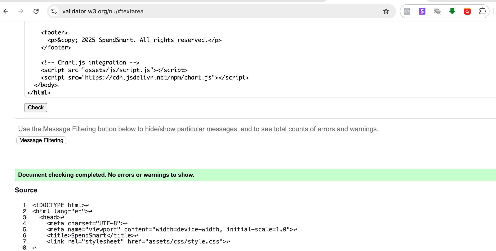

# SpendSmart

SpendSmart is a responsive JavaScript-based budgeting web app designed to help users log income and expenses, visualize their spending habits, and gain real-time insight into their financial wellness.

---

## Features

- Input fields for income and categorized expenses  
- Dynamic pie chart showing expense distribution by category  
- Live wellness score calculation based on remaining balance  
- Insightful message output based on wellness score thresholds  
- Clear, styled expense log with removable entries  
- Responsive and accessible design across devices  

---

## User Stories

**As a user:**

- I want to input my monthly income and track my expenses easily  
- I want to categorize my expenses (e.g., rent, food, entertainment)  
- I want to see how much money I have left visually  
- I want a score or message that gives insight into how I'm doing  
- I want the app to work well on both desktop and mobile devices  

---

## 💡 How the Wellness Score Works

The Wellness Score is calculated as the percentage of your income remaining after expenses:

**Formula:**  
`(Income - Total Expenses) ÷ Income × 100`

### Score Meaning:
- **81–100%** → 🎉 Excellent
- **60–80%** → 👍 Good
- **40–59%** → ⚠️ Fair
- **0–39%** → 🚨 Poor

A higher score means you're managing your budget well, while a lower score suggests overspending.

---

## Wireframes

The wireframe below represents the final layout structure of the SpendSmart app:
-

---
**Layout Structure:**

- Centered header and logo  
- Two-column layout for inputs on larger screens (single column on smaller screens)  
- Category dropdown, then buttons, then visual output  
- Pie chart followed by a full-width expense list  

---

## Technologies Used

- **HTML5**  
- **CSS3** (Flexbox, media queries)  
- **JavaScript** (DOM manipulation, array logic)  
- **Chart.js** (pie chart visualization)  
- **Git & GitHub** (version control & deployment)  

---

## Testing

- Tested on Chrome, Firefox, Edge, and Safari  
- Mobile responsiveness tested with Chrome DevTools and a real smartphone  
- Manual testing of all buttons, input fields, and dynamic updates  
- Accessibility: Sufficient contrast, logical heading structure, `aria-labels` where appropriate  
- JavaScript validated with [JSHint](https://jshint.com/) — no major issues:

- HTML validated with [W3C Validator](https://validator.w3.org/) — minor issues resolved:

 
 

**User Story Testing:**

- ✅ Income and expenses can be input and cleared  
- ✅ Categories correctly tagged to expenses  
- ✅ Pie chart accurately reflects expense breakdown  
- ✅ Wellness score updates live and consistently  
- ✅ Insight messages vary with score  
- ✅ Responsive layout adapts to different screen sizes  

---

## Deployment

- **Live Site**: [View SpendSmart](https://blvckkryptonite.github.io/SpendSmart/)  
- **GitHub Repo**: [GitHub - SpendSmart](https://github.com/BlvckKryptonite/SpendSmart.git)  
- Deployed via GitHub Pages  
- Assets folder includes Javascript file, images and stylesheet

---

## Potential Future Improvements

- Add persistent storage using localStorage or IndexedDB  
- Enable income history tracking  
- Animate transitions for added visual polish  
- Include more chart types (e.g., bar or line for monthly comparison)  

---

## Credits

- Chart.js: [https://www.chartjs.org](https://www.chartjs.org)  
- Font: Google Fonts (Lato + Oswald)  
- Logo: Created with Canva  
- Wireframe sketch: Created using hand-drawn wireframe concept and enhanced with AI (Chat GPT-4o) 

---

## Acknowledgements

This project was developed as part of the Full Stack Software Development Diploma at Code Institute.

---

_Designed and developed by Muma Kalobwe_
